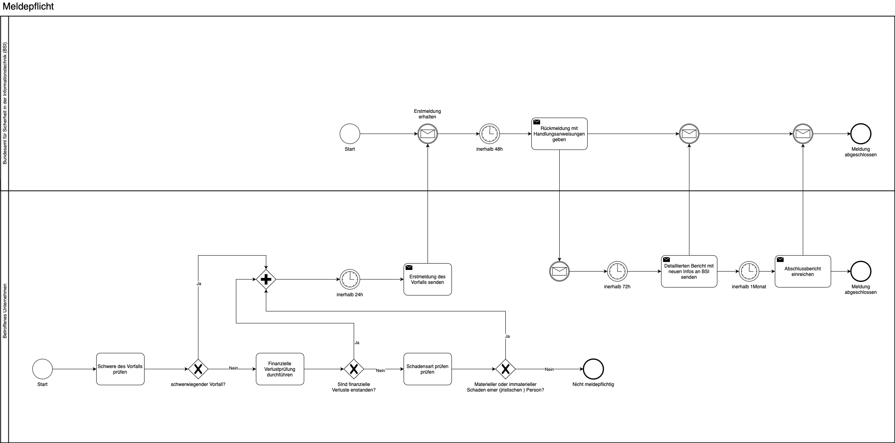

## Gesetzlicher Hintergrund – Artikel 23 NIS-2

Die NIS-2-Richtlinie verpflichtet Unternehmen zur strukturierten und fristgerechten Meldung erheblicher Sicherheitsvorfälle. Artikel 23 beschreibt dabei detailliert die einzelnen Meldephasen und Anforderungen:

- **Frühwarnung:** Innerhalb von 24 Stunden nach Kenntnisnahme eines erheblichen Sicherheitsvorfalls ist eine Frühwarnung an das zuständige CSIRT oder die Aufsichtsbehörde abzugeben – inklusive etwaiger Verdachtsmomente auf böswillige Handlungen oder grenzüberschreitende Auswirkungen.

- **Erstmeldung:** Innerhalb von 72 Stunden nach Kenntnisnahme ist eine erste offizielle Meldung des Vorfalls einzureichen. Diese muss eine erste Bewertung der Auswirkungen sowie – falls verfügbar – Kompromittierungsindikatoren enthalten.

- **Abschlussbericht:** Spätestens einen Monat nach der Erstmeldung ist ein vollständiger Abschlussbericht einzureichen. Dieser enthält eine detaillierte Beschreibung des Vorfalls, seiner Ursachen, getroffener Abhilfemaßnahmen sowie etwaiger Auswirkungen auf andere Mitgliedstaaten.

- **Weitere Berichte:** Die zuständige Behörde oder das CSIRT kann Zwischenberichte oder Fortschrittsberichte anfordern.

- **Rückmeldung:** Die zuständige Stelle muss innerhalb von 24 Stunden nach Erhalt der Frühwarnung eine Rückmeldung geben und gegebenenfalls technische Unterstützung anbieten.

- **Veröffentlichung:** In Fällen von erheblichem öffentlichem Interesse kann die zuständige Behörde die betroffene Einrichtung auffordern, den Vorfall öffentlich bekannt zu machen – oder dies selbst tun.

## Möglicher Prozess zur Meldung von Sicherheitsvorfällen

Der folgende Ablauf stellt ein Beispiel für einen möglichen internen Prozess zur Erfüllung der Meldepflicht gemäß Artikel 23 NIS-2 dar. Er zeigt die typischen Schritte von der Erstmeldung bis zum Abschlussbericht:

*Abb.: Beispielhafter Ablauf eines Meldeprozesses bei Sicherheitsvorfällen.*

> Hinweis: Dieses Prozessmodell dient als Orientierung und sollte an die individuellen Strukturen und Verantwortlichkeiten des Unternehmens angepasst werden.

