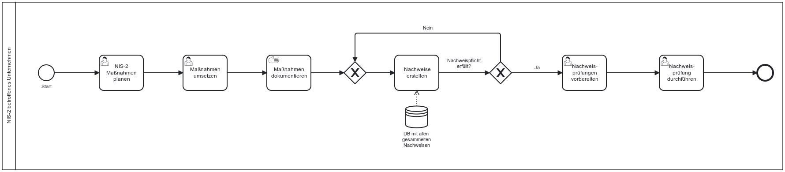

Die NIS-2-Richtlinie verpflichtet Unternehmen zu einer systematischen Dokumentation und Nachweisführung ihrer Maßnahmen zur Cybersicherheit.

## Gesetzlicher Hintergrund – Artikel 20, 21, 23, 32, 34 - NIS-2

- **Governance (Artikel 20)** Geschäftsleitungen müssen Maßnahmen nach Artikel 21 nicht nur billigen, sondern deren Umsetzung überwachen und sind im Falle von Verstößen Rechenschaftspflichtig. Das bedeutet, dass die Geschäftsleitung Nachweise für Maßnahmen gegenenfalls vorzeigen müssen.

- **Artikel 21 (Risikomanagementmaßnahmen)** Unternehmen müssen alle in Artikel 21 genannten Maßnahmen dokumentieren, da sie Grundlage für Audits und Aufsicht sind.

- **Artikel 23 (Berichtspflichten)** Unternehmen müssen nach der Bewältigung von Sicherheitsvorfällen entsprechende Nachweise über die Erkennung und Bewertung erstellen.

- **Artikel 32 & 34 (Aufsicht und Sanktionen)** Die zuständigen Behörden sind berechtigt, umfassende Kontrollen durchzuführen. Fehlen Nachweise oder ist die Dokumentation unzureichend, drohen empfindliche Geldbußen.

## Möglicher Prozess zur Dokumentation von Maßnahmen un der Erstellung von Nachweisen

Der folgende Ablauf stellt ein Beispiel für einen möglichen internen Prozess zur Dokumentation von Maßnahmen, Planung und Erstellung von Nachweisen und der Durchführung von Nachweisprüfungen:

*Abb.: Beispielhafter Ablauf zur Erfüllung der Nachweispflicht*

> Hinweis: Dieses Prozessmodell dient als Orientierung. Die Nachweispflicht ist im Kern ein Pflicht, die in fast allen relevanten Maßnahmenpflichten in NIS-2 eine Rolle spielt. Daher ist es schwierig, den Prozess isoliert zu betrachten.

