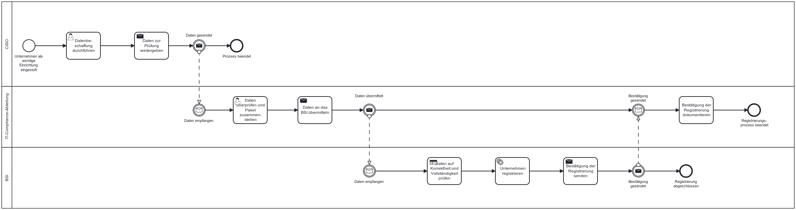

Die NIS-2-Richtlinie verpflichtet betroffene Unternehmen dazu, sich bei der zuständigen nationalen Behörde zu registrieren.

## Gesetzlicher Hintergrund - Artikel 28 NIS-2
**Wesentliche und wichtige Einrichtungen müssen sich registrieren und der zuständigen Behörde Informationen bereitstellen, darunter:**
- Name der Einrichtung
- Rechtsform
- Branche (nach Anhang I oder II)
- Hauptsitz
- Mitgliedstaat, in dem die Dienste erbracht werden
- Kontaktstelle für Cybersicherheit

Die Registrierung muss aktuell gehalten und bei relevanten Änderungen aktualisiert werden. Sie dient der zentralen Erfassung und Überwachung durch die Aufsichtsbehörden (z.B. das BSI für deutsche Einrichtungen).

## Konkretisierung im deutschen Referentenentwurf zur Umsetzung der NIS-2-Richtlinie 
**§ 33 NIS2UmsuCG-E:**
Der Referentenwntwurf zur NIS-2-Richtlinie erweitert den Fokus der Registrierung: Er betrifft nicht nur Domain-Registry-Diensteanbieter, sondern auch alle besonders wichtigen Einrichtungen und wichtigen Einrichtungen im Sinne der NIS-2. Es geht dabei um die Meldung zur Registrierung beim BSI – also nicht (nur) um DNS-bezogene Daten, sondern um die generelle Zuordnung von Organisationen zur Regulierung.

## Möglicher Prozess zur Registrierung für ein betroffenes Unternehmen beim BSI

**Annahmen**
- Das Unternehmen wurde als wichtige Einrichtung gemäß NIS-2 eingestuft.
- Es liegt eine zentrale IT-/Compliance-Abteilung vor.
- Die IP-Adressbereiche existieren, ebenso wie Handelsregisternummer, Aufsichtsbehörde usw.

*Abb.: Beispielhafter Ablauf zur Registrierung beim BSI zur Erfüllung der Registrierungspflicht*

> Hinweis: Diese Prozessbeschreibung basiert auf § 33 des deutschen NIS-2-Durchführungsgesetzes (Bearbeitungsstand 23.06.2025). § 34 (Besondere Registrierungspflicht für bestimmte Einrichtungsarten) wird in diesem Ablauf nicht berücksichtigt, da er spezifische Sonderfälle betrifft. Es handelt sich um eine modellhafte Darstellung unter Annahme eines mittelständischen Unternehmens, das als wichtige Einrichtung eingestuft wurde.
