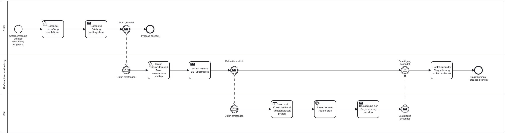

Die NIS-2-Richtlinie verpflichtet betroffene Unternehmen dazu, sich bei der zuständigen nationalen Behörde zu registrieren.

## Gesetzlicher Hintergrund - Artikel 28 NIS-2 und Paragraph 33 NIS2UmsuCG
**Wesentliche und wichtige Einrichtungen müssen der zuständigen Behörde Informationen bereitstellen, darunter:**
- Name der Einrichtung
- Rechtsform
- Branche (nach Anhang I oder II)
- Hauptsitz
- Mitgliedstaat, in dem die Dienste erbracht werden
- Kontaktstelle für Cybersicherheit

Die Registrierung muss aktuell gehalten und bei relevanten Änderungen aktualisiert werden. Sie dient der zentralen Erfassung und Überwachung durch die Aufsichtsbehörden.

## Möglicher Prozess zur Registrierung für ein betroffenes Unternehmen beim BSI

**Annahmen**
- Das Unternehmen wurde als wichtige Einrichtung gemäß NIS-2 eingestuft.
- Es liegt eine zentrale IT-/Compliance-Abteilung vor.
- Die IP-Adressbereiche existieren, ebenso wie Handelsregisternummer, Aufsichtsbehörde usw.

*Abb.: Beispielhafter Ablauf zur Registrierung beim BSI zur Erfüllung der Registrierungspflicht*

> Hinweis: Diese Prozessbeschreibung basiert auf § 33 des deutschen NIS-2-Durchführungsgesetzes (Bearbeitungsstand 23.06.2025). § 34 (Besondere Registrierungspflicht für bestimmte Einrichtungsarten) wird in diesem Ablauf nicht berücksichtigt, da er spezifische Sonderfälle betrifft. Es handelt sich um eine modellhafte Darstellung unter Annahme eines mittelständischen Unternehmens, das als wichtige Einrichtung eingestuft wurde.

## Möglicher Prozess zur Dokumentation von Maßnahmen un der Erstellung von Nachweisen

Der folgende Ablauf stellt ein Beispiel für einen möglichen internen Prozess zur Dokumentation von Maßnahmen, Planung und Erstellung von Nachweisen und der Durchführung von Nachweisprüfungen:

*Abb.: Beispielhafter Ablauf zur Erfüllung der Nachweispflicht*

> Hinweis: Dieses Prozessmodell dient als Orientierung. Die Nachweispflicht ist im Kern ein Pflicht, die in fast allen relevanten Maßnahmenpflichten in NIS-2 eine Rolle spielt. Daher ist es schwierig, den Prozess isoliert zu betrachten.

