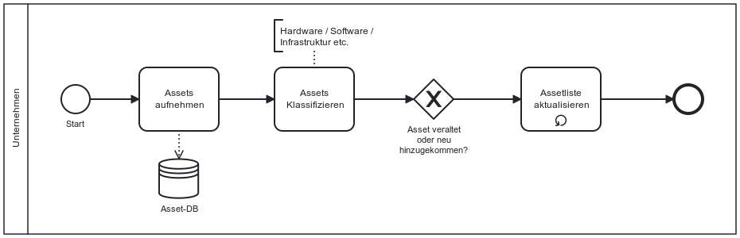

Die NIS-2-Richtlinie verpflichtet betroffene Unternehmen dazu, Asset Management zu betreiben

## Gesetzlicher Hintergrund – Artikel 21(2)(i) NIS-2 und § 30(2) Nr. 9 NIS2UmsuCG
**Die NIS-2-Richtlinie fordert explizit ein systematisches Asset Management:**
- In Artikel 21(2)(i) wird die Verwaltung von Anlagen (Assets) gemeinsam mit Themen wie Zugangskontrolle und Personalsicherheit als zentrale organisatorische Maßnahme benannt.
- Der Referentenentwurf zum deutschen NIS2UmsuCG nennt in § 30(2) Nr. 9 die Notwendigkeit von „Konzepten zur Verwaltung von IKT-Systemen, -Produkten und -Prozessen“ – damit sind sowohl Hard- und Softwarewerte als auch betriebliche Abläufe gemeint.

Asset Management ist damit eine fest verankerte Pflicht und bildet die Grundlage für nahezu alle weiteren Sicherheitsmaßnahmen. Nur wenn ein Unternehmen seine Werte, wie Systeme, Daten, Anwendungen und Prozesse systematisch erfasst und verwaltet, kann Informationssicherheit funktionieren. Ohne belastbares Asset-Inventar sind etwa BCM, physische Sicherheit oder Vorfallmanagement nicht wirksam umsetzbar. Der entsprechende Baustein im Code of Conduct unterstützt Unternehmen dabei, diese essenzielle Grundlage strukturiert und nachvollziehbar zu etablieren. 

## Möglicher Prozess im Asset Management

*Abb.: Beispielhafter Ablauf*

