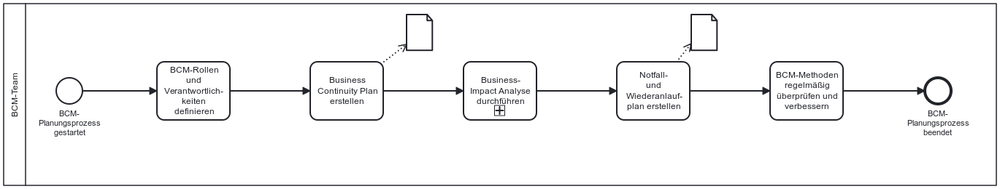

Die NIS-2-Richtlinie verpflichtet in Artikel 21 (2) (c) und im Referentenentwurf zur Umsetzung von NIS-2 in Deutschland §30 (2) Nr. 3 den Betrieb im Unternehmen aufrecht zu erhalten. Dazu gehört ein gutes Backup-Management und die Wiederherstellung nach Notfällen und Krisen. Dies bedeutet, dass Notfall-und Krisenmanagement in diesem Kapitel des CoC ebenfalls Anwendung finden.

## Gesetzlicher Hintergrund – Artikel 21 NIS-2 (2) - c und Referentenentwurf §30 (2) nr. 3

- **Verpflichtung zur Betriebsfähigkeit:** Die NIS-2-Richtlinie verpflichtet Unternehmen zur Sicherstellung der Geschäftserhaltung, auch bei Sicherheitsvorfällen oder Krisen.

- **Backup-Management:** Unternehmen müssen geeignete Strategien zur Datensicherung und Wiederherstellung implementieren, um Ausfallzeiten zu minimieren.

- **Krisenmanagement und Notfälle:** Die Richtlinie fordert ein strukturiertes Vorgehen zur Bewältigung von Notfällen. Das schließt die Definition klarer Rollen, Kommunikationswege und Wiederanlaufprozesse mit ein.

## Mögliche Prozesse zu BPMN und der Business Impact Analyse

Der folgende Ablauf zeigt ein sehr simples Beispiel zur Durchführung der BCM-Planung. In der Realität ist der Prozess wesentlich komplexer und enthält noch weitere Akteure und Aktivitäten. Der hier gezeigte Prozess dient nur als Richtung für Unternehmen, welche Aktivitäten sehr wichtig sind.

*Abb.: Beispielhafter BCM-Prozess*

> Hinweis: Weitere Prozessmodelle zum Krisenmanagement, Eskaslationsmodelle zur Behandlung von Vorfällen und Schnittstellen müssen in Zukunft noch hinzugefügt werden!

