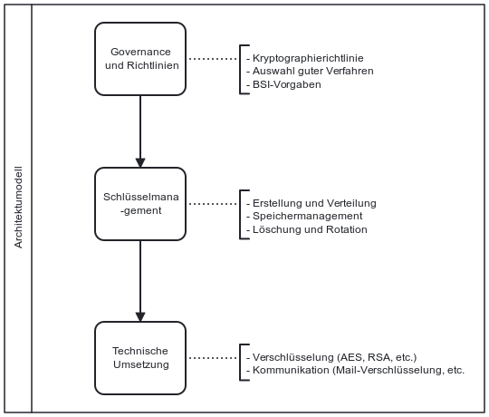

Die NIS-2-Richtlinie verpflichtet Unternehmen Konzepte und Verfahren für den Einsatz von Kryptografie und gegebenenfalls Verschlüsselung zu etablieren. Zu finden ist die Anfoderung in Artikel 21, Abs. 2 (h). Wie die Verfahren und Methoden dabei aussehen könnten, lässt die Richtlinie allerdings offen.

## Gesetzlicher Hintergrund – Artikel 21, Abs. 2 (h) NIS-2

- **Einsatz von Kryptographie** Die Richtlinie verlangt, dass betroffene Einrichtungen Konzepte und Verfahren für den Einsatz von Kryptografie und Verschlüsselungen entwickeln. Zum Einsatz kommen kann dies beispielsweise bei der Übertragung und Speicherung von Daten.

## Möglicher Aufbau und Unterteilung der einzelnen Kryptographiebereichen

Statt dem klassischen Prozessmodell (wie z. B. in BPMN) wurde für diesen Abschnitt bewusst ein Schichten-Modell gewählt. Der Grund: Der Einsatz kryptographischer Verfahren ist kein linearer Geschäftsprozess, sondern umfasst organisatorische Rahmenbedingungen, technische Komponenten sowie klare Rollenverteilungen. Der Fokus liegt daher auf einem Schichtenmodell, das die zentralen Elemente von Richtlinien, Schlüsselmanagement und technischer Umsetzung kurz zusammenführt.

## Konkretisierung im deutschen Referentenentwurf zur Umsetzung der NIS-2-Richtlinie 
**§30 nr.9 NIS2UmsuCG-E:**
Der Referentenentwurf zur Umsetzung der NIS-2-Richtlinie enthält ebenfalls die Anforderung des Einsatzes von kryptographischen Verfahren. Hier wird allerdings die Verschlüsselung nicht mehr genannt, was daran liegen kann, dass es hier als ein Teilgebiet der Kryptographie gesehen wird und keine spezifischen Anfoderungen benötigt.

*Abb.: Schichtenmodell für den Einsatz von kryptographie im Unternehmen*

> Hinweis: Dieses Modell dient als Orientierung und sollte an die individuellen Strukturen und Verantwortlichkeiten des Unternehmens angepasst werden.

