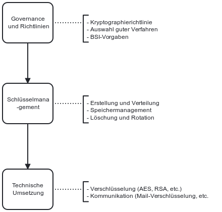

Die NIS-2-Richtlinie verpflichtet Unternehmen Konzepte und Verfahren für den Einsatz von Kryptografie und gegebenenfalls Verschlüsselung zu etablieren. Zu finden ist die Anfoderung in Artikel 21, Abs. 2 (h). Wie die Verfahren und Methoden dabei aussehen könnten, lässt die Richtlinie allerdings offen.

## Gesetzlicher Hintergrund – Artikel 21, Abs. 2 (h) NIS-2

- **Einsatz von Kryptographie** Die Richtlinie verlangt, dass betroffene Einrichtungen Konzepte und Verfahren für den Einsatz von Kryptografie und Verschlüsselungen entwickeln. Zum Einsatz kommen kann dies beispielsweise bei der Übertragung und Speicherung von Daten.

Der folgende Ablauf stellt ein Beispiel für einen möglichen Prozess im Einsatz von Kryptophie dar.

*Abb.: Beispielhafter Ablauf eines Meldeprozesses bei Sicherheitsvorfällen.*

> Hinweis: Dieses Prozessmodell dient als Orientierung und sollte an die individuellen Strukturen und Verantwortlichkeiten des Unternehmens angepasst werden.

