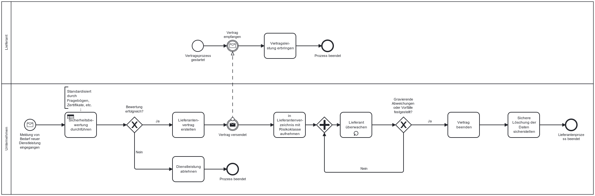

Die NIS-2-Richtlinie verpflichtet Unternehmen die Sicherheit der gesamten Lieferkette herzustellen. Hierbei sollen Beziehungen zwischen Einrichtungen untereinander und zu (Dienst)anbietern mit einbezogen werden.

## Gesetzlicher Hintergrund – Artikel 21 Abs.2 (d) NIS-2

Gemäß NIS-2 sind Unternehmen verpflichtet, auch die Sicherheit ihrer Lieferkette zu berücksichtigen. Dazu zählen insbesondere sicherheitsrelevante Aspekte in der Beziehung zu direkten Anbietern und Dienstleistern (z.B. zu IT-Dienstleistern, Cloud-Anbietern oder Softwareanbietern). Ziel ist es, Risiken aus der Zusammenarbeit mit Dritten frühzeitig zu erkennen und durch vertragliche, organisatorische und technische Maßnahmen zu minimieren.

## Konkretisierung im deutschen Referentenentwurf zur Umsetzung der NIS-2-Richtlinie 
**§30 (2) nr.4 NIS2UmsuCG-E:**
Zwischen der Formulierung in NIS-2 und dem deutschen Umsetzungsentwurf besteht kaum eine inhaltliche Konkretisierung. Beide Paragraphen adressieren die Sicherheit der Lieferkette und die sicherheitsrelevanten Aspekte in den Beziehungen zu unmittelbaren Anbietern oder Diensteanbietern. Der Text in 4. ist lediglich sprachlich verkürzt und verzichtet auf die explizite Nennung „zwischen den einzelnen Einrichtungen“.

## Möglicher Prozess zur Erhöhung der Sicherheit in der Lieferkette

Der folgende Ablauf stellt ein Beispiel für einen möglichen internen Prozess zur Erhöhung der Lieferkettensicherheit dar. Dabei spielen, die Auswahl der Dienstleistung, Überprüfung und Beendigung von Verträgen eine entscheidene Rolle. Die Aktivitäten sind bewusst nicht klassifiziert in manuelle Tasks oder Service-Tasks, da jedes Unternehmen andere Automatisierungsreifegrade haben. 

*Abb.: Beispielhafter Ablauf des Lieferantenmanagements*

> Hinweis: Dieses Prozessmodell dient als Orientierung und sollte an die individuellen Strukturen und Verantwortlichkeiten des Unternehmens angepasst werden.

