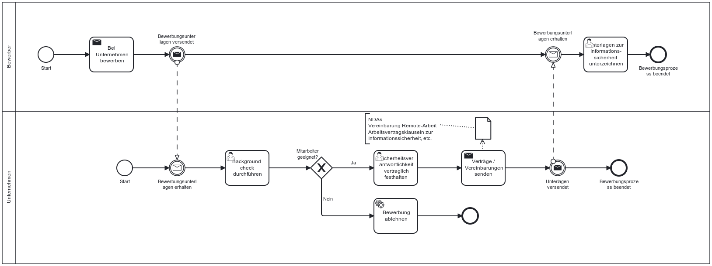

Die NIS-2-Richtlinie verpflichtet Unternehmen dazu, geeignete Maßnahmen zur Personalsicherheit, zur Zugriffskontrolle sowie zum Management von IKT-Systemen zu etablieren. 

> ⚠️ **Hinweis:** Im vorliegenden Code of Conduct (CoC) wird die Personalsicherheit als eigenständiger Abschnitt behandelt, da sie eine zentrale und komplexe Rolle in der Sicherheitsarchitektur einnimmt. Aspekte der Zugriffskontrolle (Access Control) werden im CoC **gesondert** betrachtet und sind dort ausführlich dokumentiert.

---

## 📘 Gesetzlicher Hintergrund – Personalsicherheit gemäß NIS-2

Gemäß Artikel 21 Abs. 2 der NIS-2-Richtlinie sowie §30 (2) Punkt 9 des aktuellen nationalen Umsetzungsgesetzes (Referentenentwurf) sind Unternehmen verpflichtet, insbesondere:

- **Konzepte zur Sicherheit des Personals** zu entwickeln und umzusetzen.  
  → Darunter fallen Hintergrundprüfungen, Sensibilisierung, Verhaltensrichtlinien und der sichere Umgang mit sensiblen Informationen.

- **Zugriffsrechte rollenbasiert zu vergeben, zu prüfen und zu widerrufen**  
  → Dies erfordert technische und organisatorische Maßnahmen – wird im CoC separat behandelt.

- **Verfahren zur Verwaltung von IKT-Systemen, -Produkten und -Prozessen** aufzusetzen  
  → Fokus liegt auf klaren Zuständigkeiten und Schutz sensibler Systeme durch geschultes, überprüftes und vertrauenswürdiges Personal.

---

## Möglicher Prozess zur Umsetzung der Personalsicherheit

Der folgende Ablauf zeigt exemplarisch, wie der **Bewerbungsprozess** aus der Perspektive der Informationssicherheit durchgeführt werden kann. Es gibt allerdings noch weitere Prozesse, wie schulungsprozesse für Personal ([Siehe Schulung und Sensibilisierung]([Siehe Schulungen und Sensibilisierung](https://github.com/ruppfabian1997/CoC-NIS-2/blob/main/TOMs/Schulungen%20und%20Cyberhygiene/01_%C3%9Cberblick.md))), sichere Offboardingprozesse etc. Diese sind allerdings nicht explizit hier aufgeführt.

*Abb.: Beispielhafter Ablauf zur Umsetzung der Bewerbung nach Sicherheitsstandards*

---

> **Anpassungshinweis:** Der dargestellte Prozess dient als Orientierung. Abhängig von Unternehmensgröße, Branche und vorhandener Governance-Struktur sollten Rollen, Verantwortlichkeiten und Prüfprozesse individuell angepasst werden.
