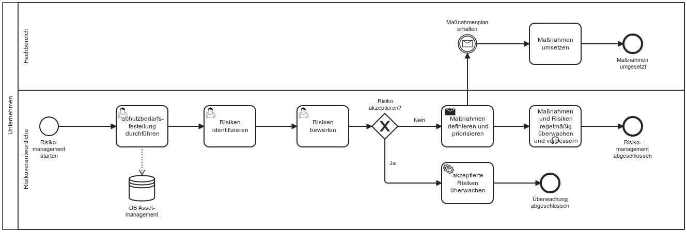

Die NIS-2-Richtlinie verpflichtet Unternehmen, geeignete und verhältnismäßige Maßnahmen zur Beherrschung von Risiken für die Sicherheit ihrer Netz- und Informationssysteme umzusetzen.

---

## Gesetzlicher Hintergrund – Artikel 21 Abs. 2 (a) NIS-2 

- **Risikobasierter Ansatz**  
  Die Richtlinie fordert, dass betroffene Einrichtungen Konzepte zur Risikoanalyse und Informationssicherheit entwickeln. Ziel ist es, Risiken systematisch zu identifizieren, zu bewerten und geeignete Maßnahmen zur Risikobehandlung abzuleiten. Der risikobasierte Ansatz spiegelt sich auch im Namen des Artikels 21 wider: Risikomanageemntmaßnahmen im Bereich Cybersicherheit.

- **Verhältnismäßigkeit & Stand der Technik**  
  Die Maßnahmen sollen dem Stand der Technik entsprechen und unter wirtschaftlich vertretbarem Aufwand ein dem Risiko angemessenes Schutzniveau erreichen.

## Konkretisierung im deutschen Referentenentwurf zur Umsetzung der NIS-2-Richtlinie 
**§30 Abs. 2 Nr. 1 NIS2UmsuCG-E:**
In der NIS-2-Richtlinie (Artikel 21), wie auch im Referentenentwurf (§30) ist von Risikomanagementmaßnahmen die Rede. Dies bedeutet, dass auch im Umsetzungsgesetz ein gesamtheitlicher risikobasierter Ansatz gewählt wird. Die Risikoanalyse, wie auch Konzepte für die Informationssicherheit sind ebenfalls benannt. Daher findet hier keine inhaltliche Konkretisierung statt.

## Möglicher Prozess im Risikomanagement

Der folgende Ablauf stellt ein Beispiel für einen möglichen Prozess der Risikoanalyse dar. Hierbei gibt es eine risikoverantwortliche Person. Diese plant, steuert und überwacht das Risikomanagement. Im Assetmanagement werden alle Unternehmenswerte und Prozesse gesammelt und anschließénd deren Schutzbedarf bestimmt. Auf dieser Basis werden Risiken für alle schutzbedürftigen Assets definiert und priorisiert. Dann werden Maßnahmen abgeleitet, die von einzelnen Risikoeigentümern in den Fachbereichen umgesetzt werden.

*Abb.: Beispielhafter Ablauf im Risikomanagement*

> Hinweis: Dieses Prozessmodell dient als Orientierung und sollte an die individuellen Strukturen und Verantwortlichkeiten des Unternehmens angepasst werden.

