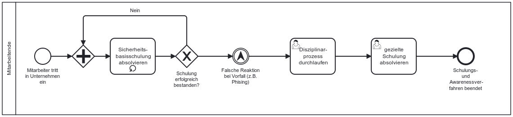

Die NIS-2-Richtlinie verpflichtet Unternehmen, grundlegende Verfahren im Bereich der Cyberhygiene und Schulungen im Bereich der Cybersicherheit einzuführen. 

## Gesetzlicher Hintergrund – Cyberhygiene & Schulungen (Art. 21 Abs. (g) NIS-2

Die Anforderung der Richtlinie: „grundlegende Verfahren im Bereich der Cyberhygiene und Schulungen im Bereich der Cybersicherheit umzusetzen“, zielt zielt darauf ab, ein organisationsweites Grundverständnis für sicheren Umgang mit Inforamtionen zu etablieren und das Verhalten von Mitarbeitenden mit in die Sicherheitsstrategie einzubinden.

**Warum werden Schulungen und Cyberhygiene in der NIS-2-Richtlinnie gemeinsam genannt?**

Technische Maßnahmen nur wirksam sind, wenn Menschen sie verstehen und mittragen.

Schulungen machen Mitarbeitende handlungsfähig.
Sie helfen, Cyberhygiene-Regeln zu verstehen und anzuwenden.
Sie fördern Awareness und senken das Risiko menschlicher Fehler.
Eine gute Sicherheitskultur besteht aus klaren Verhaltensregeln (Cyberhygiene) und gezielter Kompetenzvermittlung (Schulung), daher könnten in NIS-2 beide Punkte gemeinsam genannt werden.

## Möglicher Prozess zur Etablierung von Schulungen und Cyberhygiene

Der folgende Ablauf stellt ein Beispiel für einen möglichen internen schulungszyklus und einen Cyberhygieneprozess aus Sicht der Mitarbeitenden dar.

*Abb.: Beispielhafter Ablauf von Schulungen und Awarenessmaßnahmen aus Sicht eines Mitarbeitenden*

> Hinweis: Dieses Prozessmodell dient als Orientierung und sollte an die individuellen Strukturen und Verantwortlichkeiten des Unternehmens angepasst werden.

