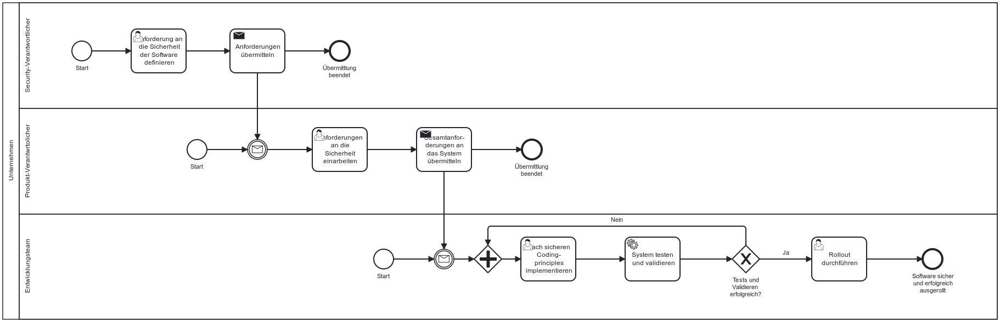

Die NIS-2-Richtlinie verpflichtet Unternehmen dazu, bei der Beschaffung, Entwicklung und Wartung von Systemen, Komponenten und Prozessen geeignete Sicherheitsmaßnahmen zu ergreifen. Dazu gehört auch Schwachstellenmanagement. 

> Hinweis: Dieser Baustein verwendet den Begriff der Systemsicherheit, auch wenn implizit mehr dahinter steckt. Es wird aus Lesbarkeitsgründen von einem Längeren Titel abgesehen.

## Gesetzlicher Hintergrund – Artikel 23 NIS-2

Unternehmen sind verpflichtet, beim Erwerb, der Entwicklung und der Wartung von Netz- und Informationssystemen angemessene Sicherheitsmaßnahmen zu implementieren.

- **Sichere Beschaffung:** Bereits bei der Auswahl und Beschaffung von IT-Systemen und -Komponenten müssen Sicherheitsanforderungen berücksichtigt werden (Also schon VOR dem Einsatz).

- **Sichere Entwicklung:** Bei der (Weiter-)Entwicklung von Software sind Standards für sichere Entwicklung (z. B. Secure Coding, Code Reviews) einzuhalten.

- **Wartung & Updates:** Systeme müssen regelmäßig geupdatet werden. Ein Patch-Management-Prozess zur Behebung von Schwachstellen ist verpflichtend.

- **Schwachstellen-Management:** Es soll ein strukturierter Prozess zur Erkennung, Bewertung und Behandlung von Schwachstellen bestehen (Inklusive der koordinierten Offenlegung von Schwachstellen).

## Konkretisierung im deutschen Referentenentwurf zur Umsetzung der NIS-2-Richtlinie 
**§ 30 NIS2UmsuCG-E:**
> Sicherheitsmaßnahmen bei Erwerb, Entwicklung und Wartung von informationstechnischen Systemen, Komponenten und Prozessen, einschließlich Management und Offenlegung von Schwachstellen

Der deutsche Referentenentwurf konkretisiert die Vorgabe aus der NIS-2-Richtlinie, indem er explizit auch informationstechnische Systeme, Komponenten und Prozesse einbezieht. Damit erweitert er den Anwendungsbereich und schafft mehr Klarheit.

## Möglicher Prozess zur Einhaltung der Systemsicherheit

Dieser Baustein beinhaltet im Kern einige komplexe Prozesse, die nicht alle und nicht in voller Detailtiefe dargestellt werden können. Prozesse die in der Pflicht relevant sind: 
- Sicherer Softwareentwicklungsprozess
- Systembeschaffungsprozess
- Changemanagemetprozess
- Patchmanagementprozess
- Prozess zur Erkennung und Behebung von Schwachstellen
- Ausschreibungs- und Evaluierungsprozess beim Kauf von Software

Im Folgenden ist ein möglicher Prozess zur sicheren Entwicklung von Software dargestellt. Schon in einer frühen Phase werden die Anforderungen der Sicherheitsbeauftragten eingebracht. Das sind unter anderem Vorgaben zu Vertraulichkeit, Integrität, Verfügbarkeit, Zugriffskontrolle, sicheren Schnittstellen und Datenschutz Vorgaben. Der Gesamtverantwortliche für das Produkt übernimmt diese Sicherheitsanforderungen und integriert sie in die Gesamtanforderungen an die Software, sodass Sicherheit von Beginn an Teil der gesamten Anwendung ist. Das Entwicklungsteam setzt die Vorgaben anschließend mit etablierten Secure Coding Principles um, wie etwa 

- Eingabevalidierung
- Prinzip der minimalen Rechte
- sichere Authentifizierung und Autorisierung

Nach der Implementierung erfolgen strukturierte Tests und Validierungen, um Sicherheitslücken, Fehlfunktionen und Abweichungen von den Anforderungen zu identifizieren. Treten Mängel auf, beginnt eine Schleife aus Überarbeitung, erneutem Testen und Validieren, bis alle Anforderungen erfüllt sind. Erst dann wird die Software produktiv ausgerollt.

*Abb.: Beispielhafter Ablauf eines Meldeprozesses bei Sicherheitsvorfällen.*

> Hinweis: Dieses Prozessmodell dient als Orientierung und sollte an die individuellen Strukturen und Verantwortlichkeiten des Unternehmens angepasst werden.

