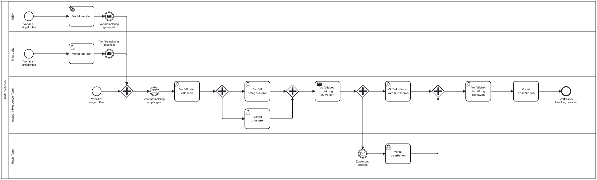

Die NIS-2-Richtlinie verpflichtet Unternehmen dazu, geeignete Maßnahmen zur Bewältigung von Sicherheitsvorfällen zu etablieren.

> ⚠️ **Hinweis:** Vorfallmanagement bezieht sich auf die strukturierte Erkennung, Meldung, Bewertung und Behandlung von Sicherheitsvorfällen (z.B. wenn eine Phishing-Mail geöffnet wurde oder ein System etwas tut, was es nicht tun soll). Ziel ist es, den Vorfall schnell zu erfassen, zu analysieren und zu beheben, bevor größerer Schaden entsteht. Notfall- und Krisenmanagement greift, wenn der Vorfall so schwerwiegend ist, dass er den Geschäftsbetrieb gefährdet (Bei einem erfolgreichen Ransomware-Angriff beispielsweise). Hier geht es um den geordneten Umgang mit der Krise, um schnelle Wiederherstellung und Kommunikation und um die Aufrechterhaltung des Betriebs.
>Im CoC ist das Thema Vorfallmanagement klar abgegrenzt vom Thema Business Continuity, Notfallmanagement, Backupmanagement etc.
> ALSO -> Ein Vorfall ist nicht automatisch ein Notfall!

---

## 📘 Gesetzlicher Hintergrund – Behandlung von Sicherheitsvorfällen gemäß NIS-2

Gemäß Artikel 21 Abs. 2 (b) der NIS-2-Richtlinie sowie §30 (2) Punkt 2 des aktuellen nationalen Umsetzungsgesetzes (Referentenentwurf) sind Unternehmen verpflichtet:

- **Sicherheitsvorfälle** richtig zu bewältigen.  
  - Darunter fallen Erkennung, Bewertung und Reaktion auf Sicherheitsvorfälle (Prozess und nicht nur ein einzelner Schritt)
  - Es braucht einen strukturierten Ablauf (Näher betrachtet als BPMN Prozess)
  - Einige Personen und Fachabteilungen sind daran beteiligt
  - Es existieren Überschneidungen zu anderen Bausteinen im CoC (Meldepflicht, Notfall- und Krisenmanagement)
 
Im weiteren Verlauf des CoC ist neben Vorfallmanagement häufig auch von Incident Response die Rede. Die beiden Begriffe werden synonym verwendet. 

---

## Möglicher Prozess zur Umsetzung der Personalsicherheit

Der folgende Ablauf zeigt exemplarisch, wie Unternehmen bei der Bewältigung von Sicherheitsvorfällen vorgehen können. Es ist zu beachten, dass dieser Prozess in vielen Fällen hoch-automatisiert ablaufen kann. Auch die verschiedenen daran beteiligten Stellen variieren stark je nach Unternehmen. Nicht jedes Unternehmen kann sich beispielsweise ein eigenes Incident-Response-Team oder ein SIEM-System leisten. Der Prozess ist lediglich ein Best-Practice-Vorschlag und sollte noch weiter optimiert und angepasst werden.

*Abb.: Beispielhafter Ablauf bei der Bewältigung von Sicherheitsvorfällen

---

> **Anpassungshinweis:** Der dargestellte Prozess dient als Orientierung. Abhängig von Unternehmensgröße, Branche und vorhandener Governance-Struktur sollten Rollen, Verantwortlichkeiten und Prüfprozesse individuell angepasst werden.

