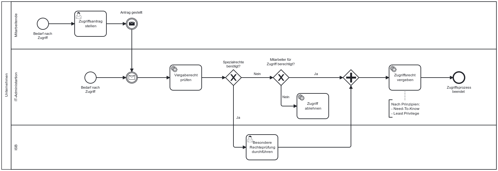

Die NIS-2-Richtlinie verpflichtet Unternehmen, geeignete Konzepte für die Zugriffskontrolle sowie Maßnahmen zur sicheren Kommunikation innerhalb der Einrichtung umzusetzen. Zusätzlich ist in diesem Baustein auch der **Einsatz von Multifaktor-Authentifizierung** und **gesicherten Kommunikationssystemen** zu finden.

## Gesetzlicher Hintergrund – Artikel 21, Abs. 2 (i)

- **Zugriffsmanagement und sichere Kommunikation:**  
  Unternehmen sind verpflichtet, Konzepte und Verfahren für die Zugriffskontrolle sowie das Management ihrer IT-Systeme und Anlagen zu entwickeln. Zusätzlich sollen geeignete Authentisierungsverfahren (z. B. Multifaktor-Authentifizierung) sowie gesicherte Sprach-, Text- und Videokommunikationssysteme zum Einsatz kommen. Auch die Kommunikation im Notfall ist abzusichern.

Der folgende Ablauf stellt ein Beispiel für einen möglichen internen Prozess zur Umsetzung des Zugriffsmanagements dar. Eine Mitarbeitende Person möchte beispielsweise Zugriff auf ein System. Hierfür werden Rechte geprüft und nach prinzipien vergeben. Im Zugriffsmanagement gibt es noch weitere Prozesse, wie der Rechteentzug nach Verlassen des Unternehmens, der Rechtevergabe im Onboarding etc. Diese Prozesse sind hier nicht explizit aufgeführt, spielen aber dennoch eine Rolle im Zugriffsmanagement.

*Abb.: Beispielhafter Ablauf zur Verwaltung von Zugriffsrechten und Kommunikationssicherheit.*

> Hinweis: Dieses Prozessmodell dient als Orientierung und sollte an die individuellen IT-Systeme, Rollen und Geschäftsprozesse des Unternehmens angepasst werden.

